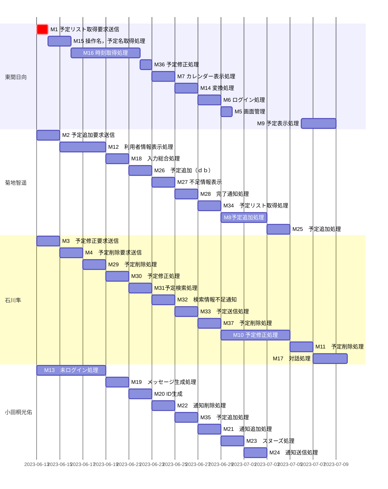

```mermaid
gantt
dateFormat YYYY-MM-DD
section 東間日向
M1 予定リスト取得要求送信 :crit, 2023-6-13, 1d
M15 操作名，予定名取得処理 :a1, 2023-6-14, 2d
M16 時刻取得処理 :a1, 2023-6-16, 6d
M36 予定修正処理 :a1, 2023-6-22, 1d
M7 カレンダー表示処理 :a1, 2023-6-23, 2d
M14 変換処理 :a1, 2023-6-25, 2d
M6 ログイン処理 :a1, 2023-6-27, 2d
M5 画面管理 :a1, 2023-6-29, 1d
M9 予定表示処理 :a1, 2023-7-6, 3d
section 菊地智遥
M2 予定追加要求送信 :a1, 2023-6-13, 2d
M12　利用者情報表示処理 :a1, 2023-6-15, 4d
M18　入力総合処理 :a1, 2023-6-19, 2d
M26　予定追加（ｄｂ） :a1, 2023-6-21, 2d
M27 不足情報表示 :a1, 2023-6-23, 2d
M28　完了通知処理 :a1, 2023-6-25, 2d
M34　予定リスト取得処理 :a1, 2023-6-27, 2d
M8予定追加処理 :a1, 2023-6-29, 4d
M25　予定追加処理 :a1, 2023-7-3, 2d
section 石川隼
M3　予定修正要求送信 :a1, 2023-6-13, 2d
M4　予定削除要求送信 :a1, 2023-6-15, 2d
M29　予定削除処理 :a1, 2023-6-17, 2d
M30　予定修正処理 :a1, 2023-6-19, 2d
M31予定検索処理 :a1, 2023-6-21, 2d
M32　検索情報不足通知 :a1, 2023-6-23, 2d
M33　予定送信処理 :a1, 2023-6-25, 2d
M37　予定削除処理 :a1, 2023-6-27, 2d
M10 予定修正処理 :a1, 2023-6-29, 6d
M11　予定削除処理 :a1, 2023-7-5, 2d
M17　対話処理 :a1, 2023-7-7, 3d
section 小田桐光佑
M13　未ログイン処理 :a1, 2023-6-13, 6d
M19　メッセージ生成処理 :a1, 2023-6-19, 2d
M20 ID生成 :a1, 2023-6-21, 2d
M22　通知削除処理 :a1, 2023-6-23, 2d
M35　予定追加処理 :a1, 2023-6-25, 2d
M21　通知追加処理 :a1, 2023-6-27, 2d
M23　スヌーズ処理 :a1, 2023-6-29, 2d
M24　通知送信処理 :a1, 2023-7-1, 2d

```